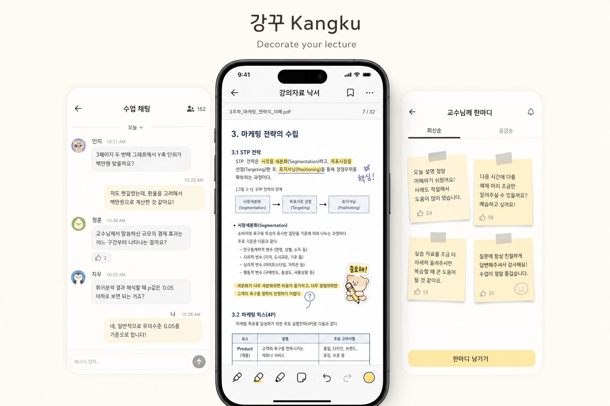

# 강꾸 Kangku



**강꾸(Kangku)**는 강의자료 위에 낙서, 채팅, 공부 기록, 피드백을 얹어 수업을 더 적극적으로 꾸미는 강의 참여형 앱입니다.

다이어리 꾸미기를 “다꾸”라고 부르듯, 강꾸는 **강의 꾸미기**를 하나의 수업 경험으로 만듭니다. 강의자료를 단순히 보는 것이 아니라, 학생들의 반응과 질문, 필기 흔적, 공부 기록을 강의자료 위에 쌓아 수업을 함께 꾸미고 복습할 수 있게 합니다.

## Product concept

기존 강의는 대부분 일방향입니다. 교수자는 설명하고, 학생은 듣고, 조용히 필기한 뒤 수업은 지나갑니다.

강꾸는 그 흐름 위에 학생들의 참여 레이어를 올립니다.

- 강의자료 위에 직접 낙서하고 표시하기
- 수업시간에만 열리는 채팅으로 반응과 질문 남기기
- 필기 인증, 요약 노트, 헷갈린 개념 같은 공부 흔적 공유하기
- 교수님께 짧은 피드백과 질문 남기기

즉, 강꾸는 **강의자료를 중심으로 학생들의 참여와 기록을 모으는 소셜 레이어**입니다.

## Core features

### 1. 강의자료 낙서

학생은 PDF, PPT, 강의자료 위에 직접 표시하고 꾸밀 수 있습니다.

- 밑줄 긋기
- 형광펜 표시
- 메모 붙이기
- 그림/스티커 추가
- 중요한 부분 표시
- 헷갈리는 부분 체크

개인 필기처럼 사용할 수 있고, 일부 낙서는 친구나 같은 수업 사람들과 공유할 수 있습니다.

### 2. 수업시간에만 열리는 채팅

수업 시작과 함께 열리고, 수업 종료 후에는 더 이상 작성할 수 없는 실시간 채팅방입니다.

- 수업 시작 시 자동 오픈
- 수업 종료 후 작성 잠금
- 기록은 남겨 복습 때 확인
- 강의자료 페이지와 연결된 질문/반응 관리

일반 단톡방과 달리, 수업 맥락 안에서만 작동하는 채팅입니다.

### 3. 공부하는 것 공유

학생들이 공부 흔적과 정리 내용을 공유합니다.

- 오늘 필기 인증
- 요약 노트 공유
- 헷갈린 개념 공유
- 시험 대비 정리 공유
- 친구의 필기 참고
- 내가 표시한 중요 부분 공유

혼자 공부하는 느낌이 아니라, 같은 수업을 듣는 사람들과 함께 공부하는 느낌을 줍니다.

### 4. 교수님께 한마디

칠판이나 포스트잇 보드처럼 학생들이 교수님께 짧은 말을 남길 수 있습니다.

- “이 부분 다시 설명해주세요”
- “오늘 예시 좋았어요”
- “과제 마감 한 번만 더 알려주세요”
- “시험 범위 궁금해요”
- “여기 너무 어려웠어요”

익명 또는 실명으로 운영할 수 있고, 교수자는 학생들의 이해도와 수업 분위기를 빠르게 확인할 수 있습니다.

## Positioning

강꾸는 단순 필기 앱이 아닙니다.

- GoodNotes처럼 필기하고
- 카카오톡처럼 반응하고
- Padlet처럼 공유하지만
- 모든 것이 강의자료와 수업시간에 연결된 앱입니다.

## MVP scope

### MVP 1순위

- 강의자료 업로드/PDF 보기
- 자료 위 낙서/필기
- 수업별 채팅방
- 수업 종료 후 채팅 잠금
- 교수님께 한마디 보드

### MVP 2순위

- 낙서 공유
- 공부 인증 피드
- 친구 필기 보기
- 익명 질문
- 인기 질문/공감 기능

### Later

- 스티커/템플릿
- 강의별 커뮤니티
- 시험기간 공부방
- AI 요약
- 교수자 대시보드
- 출석/퀴즈 연동

## Apps

- `kangku-mobile`: React Native/Expo + TypeScript mobile app skeleton.
- `kangku-be`: FastAPI backend skeleton.
- `kangku-web`: React web frontend for landing, app preview, and share/fallback pages.

## Local services

```bash
docker compose up -d postgres minio
```

- Postgres: `localhost:5432`
- MinIO S3 API: `localhost:9000`
- MinIO console: `localhost:9001`

## Backend

```bash
cd kangku-be
uv sync
uv run pytest
uv run uvicorn app.main:app --reload
```

## Web

```bash
cd kangku-web
npm install
npm run dev
```

## Mobile

```bash
cd kangku-mobile
npm install
npm run typecheck
```
